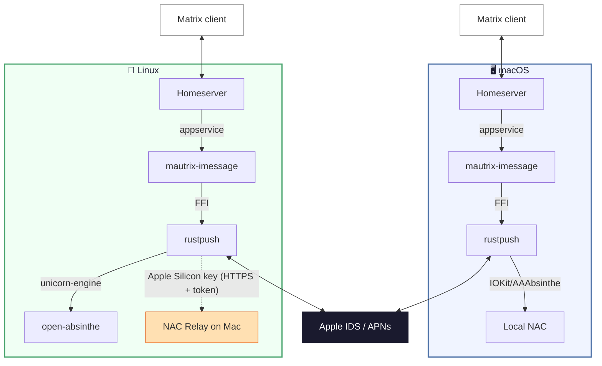

# mautrix-imessage (v2)

A Matrix-iMessage puppeting bridge. Send and receive iMessages from any Matrix client.

This is the **v2** rewrite using [rustpush](https://github.com/OpenBubbles/rustpush) and [bridgev2](https://mau.fi/blog/megabridge-twilio/) — it connects directly to Apple's iMessage servers without SIP bypass, Barcelona, or relay servers.

**Features**: text, images, video, audio, files, reactions/tapbacks, edits, unsends, typing indicators, read receipts, group chats, SMS forwarding, and contact name resolution.

**Platforms**: macOS (full features) and Linux (via hardware key extracted from a Mac once).

## Quick Start (macOS)

macOS 13+ required (Ventura or later). Sign into iCloud on the Mac running the bridge (Settings → Apple ID) — this lets Apple recognize the device so login works without 2FA prompts.

### With Beeper

```bash
git clone https://github.com/lrhodin/imessage.git
cd imessage
make install-beeper
```

The installer handles everything: Homebrew, dependencies, building, Beeper login, iMessage login, config, and LaunchAgent setup.

### With a Self-Hosted Homeserver

```bash
git clone https://github.com/lrhodin/imessage.git
cd imessage
make install
```

The installer auto-installs Homebrew and dependencies if needed, asks three questions (homeserver URL, domain, your Matrix ID), generates config files, handles iMessage login, and starts the bridge as a LaunchAgent. It will pause and tell you exactly what to add to your `homeserver.yaml` to register the bridge.

### Standalone HTTP REST API (no Matrix)

Use the bridge as a standalone iMessage API — no Matrix homeserver required:

```bash
git clone https://github.com/lrhodin/imessage.git
cd imessage
make install-api
```

The installer configures the HTTP API (listen address, API key, webhooks), handles iMessage login via CLI, and starts the service as a LaunchAgent. Once running:

- **Swagger docs**: http://localhost:8080/api/v1/docs
- **Send messages**: `POST /api/v1/send` (DM and group)
- **Receive events**: configure a webhook URL during setup (messages, reactions, group updates)
- **Query**: `GET /api/v1/chat` (chat info) and `GET /api/v1/contact` (contact lookup)
- **Login via API**: `POST /api/v1/login/start` + `POST /api/v1/login/step`

See [HTTP REST API](#http-rest-api) for full details.

## Quick Start (Linux)

The bridge runs on Linux using a hardware key extracted once from a real Mac. No Mac needed at runtime for Intel keys; **Apple Silicon Macs** require the NAC relay (a small background process on the Mac).

### Prerequisites

Ubuntu 22.04+ (or equivalent). Only `git`, `make`, and `sudo` are needed — the build installs everything else:

```bash
sudo apt install -y git make
```

### Step 1: Extract hardware key (one-time, on your Mac)

**If the Mac has Go installed (macOS 13+):**

```bash
git clone https://github.com/lrhodin/imessage.git
cd imessage
go run tools/extract-key/main.go
```

**If the Mac is older (macOS 10.13 High Sierra through 12) or doesn't have Go:**

Cross-compile on any Mac that has Go, then copy the binary over:

```bash
# On your newer Mac (with Go installed):
git clone https://github.com/lrhodin/imessage.git
cd imessage
make extract-key-intel

# Copy to the older Mac:
scp extract-key-intel user@old-mac:~/

# On the older Mac:
cd ~ && ./extract-key-intel
```

This reads hardware identifiers (serial, MLB, ROM, etc.) and outputs a base64 key. The Mac is not modified and can continue to be used normally.

**Apple Silicon Macs** lack the encrypted IOKit properties needed by the x86_64 NAC emulator. You must also run the NAC relay — a small HTTP server that generates Apple validation data using the Mac's native `AAAbsintheContext` framework.

**Set up the relay:**

```bash
go build -o ~/bin/nac-relay ./tools/nac-relay/
~/bin/nac-relay --setup
```

This installs a LaunchAgent that starts on login and auto-restarts if it crashes. On first run, grant **Full Disk Access** and **Contacts** access when prompted — this enables chat history backfill (including images and attachments), contact name resolution, and SMS forwarding from the Mac.

The relay auto-generates a self-signed TLS certificate and a random bearer token on first start, stored in `~/Library/Application Support/nac-relay/`. All endpoints (except `/health`) require the token. The bridge verifies the relay's certificate fingerprint (Go side) and authenticates with the token (both Go and Rust sides).

```bash
# Check it's running
tail -f /tmp/nac-relay.log
```

**Extract the key with the relay URL:**

```bash
go run tools/extract-key/main.go -relay https://<your-mac-ip>:5001/validation-data
```

The `extract-key` tool reads the token and certificate fingerprint from `relay-info.json` (written by the relay) and embeds them in the hardware key automatically. The relay must be running before you run `extract-key`.

If the bridge runs outside your LAN (e.g., cloud VM), forward port 5001 TCP to your Mac's local IP. Lock the allowed source IPs to your bridge server's IP for defense in depth — the relay is also protected by TLS + bearer token auth.

**Intel Macs**: The NAC relay is not needed. The bridge runs the x86_64 NAC emulator locally on Linux using hardware data from the extracted key. Chat history starts from when you log in and contacts appear by phone number / email.

### Step 2: Build and install the bridge (on Linux)

#### With Beeper

```bash
git clone https://github.com/lrhodin/imessage.git
cd imessage
make install-beeper
```

#### With a Self-Hosted Homeserver

```bash
git clone https://github.com/lrhodin/imessage.git
cd imessage
make install
```

#### Standalone HTTP REST API (no Matrix)

```bash
git clone https://github.com/lrhodin/imessage.git
cd imessage
make install-api
```

On first run expect ~3 minutes for the Rust library to compile.

### Step 3: Login

DM the bridge bot and choose the **"Apple ID (External Key)"** login flow:

1. Paste your hardware key (base64)
2. Enter your Apple ID and password
3. Enter the 2FA code sent to your trusted devices

The bridge registers with Apple's servers and starts receiving iMessages.

## Login

Follow the prompts: Apple ID → password → 2FA (if needed) → handle selection. If the Mac is signed into iCloud with the same Apple ID, login completes without 2FA.

If your Apple ID has multiple identities registered (e.g. a phone number and an email address), you'll be asked which one to use for outgoing messages. This is what recipients see your messages "from". To change it later, set `preferred_handle` in the config (see [Configuration](#configuration)) or log in again.

> **Tip:** In a DM with the bot, commands don't need a prefix. In a regular room, use `!im login`, `!im help`, etc.

### SMS Forwarding

To bridge SMS (green bubble) messages, enable forwarding on your iPhone:

**Settings → Messages → Text Message Forwarding** → toggle on the bridge device.

### Chatting

Incoming iMessages automatically create Matrix rooms. If Full Disk Access is granted (macOS), existing conversations from Messages.app are also synced.

To start a **new** conversation:

```
resolve +15551234567
```

This creates a portal room. Messages you send there are delivered as iMessages.

## How It Works

The bridge connects directly to Apple's iMessage servers using [rustpush](https://github.com/OpenBubbles/rustpush) with local NAC validation (no SIP bypass, no relay server). On macOS with Full Disk Access, it also reads `chat.db` for message history backfill and contact name resolution.

On Linux, NAC validation uses one of two paths:

- **Intel key**: [open-absinthe](rustpush/open-absinthe/) emulates Apple's `IMDAppleServices` x86_64 binary via unicorn-engine, hooking IOKit/CoreFoundation calls and feeding them hardware data from the extracted key
- **Apple Silicon key + relay**: The bridge fetches validation data from a NAC relay running on the Mac, which calls Apple's native `AAAbsintheContext` framework



### Real-time and backfill

**Real-time messages** flow through Apple's push notification service (APNs) via rustpush and appear in Matrix immediately.

**CloudKit backfill** (optional, off by default) syncs your iMessage history from iCloud on first login. Enable it during `make install` or by setting `cloudkit_backfill: true` in config. When enabled, the login flow will ask for your device PIN to join the iCloud Keychain trust circle, which grants access to Messages in iCloud. The backfill window is controlled by `initial_sync_days` (default: 1 year).

## Management

### macOS

```bash
# View logs
tail -f data/bridge.stdout.log

# Restart (auto-restarts via KeepAlive)
launchctl kickstart -k gui/$(id -u)/com.lrhodin.mautrix-imessage

# Stop until next login
launchctl bootout gui/$(id -u)/com.lrhodin.mautrix-imessage

# Uninstall
make uninstall
```

### Linux

```bash
# If using systemd (from make install / make install-beeper)
systemctl --user status mautrix-imessage
journalctl --user -u mautrix-imessage -f
systemctl --user restart mautrix-imessage

# If running directly
./mautrix-imessage-v2 -c data/config.yaml
```

### Docker

```bash
# Build the image
docker build -t mautrix-imessage .

# 1. Generate default config (first run — prints instructions and exits)
docker run --rm -v ./data:/data mautrix-imessage

# 2. Edit data/config.yaml (see printed instructions for required fields)

# 3a. Start in API-only mode (no Matrix homeserver needed)
docker run -d --name mautrix-imessage \
  -v ./data:/data \
  -p 8080:8080 \
  mautrix-imessage api-only -c /data/config.yaml

# 3b. Or start in Matrix bridge mode (requires homeserver config)
docker run -d --name mautrix-imessage \
  -v ./data:/data \
  mautrix-imessage -c /data/config.yaml

# View logs
docker logs -f mautrix-imessage

# Login via CLI inside the container
docker run -it --rm -v ./data:/data \
  mautrix-imessage login -c /data/config.yaml

# Stop / restart
docker stop mautrix-imessage
docker start mautrix-imessage
```

### NAC Relay (macOS)

```bash
# View logs
tail -f /tmp/nac-relay.log

# Restart
launchctl kickstart -k gui/$(id -u)/com.imessage.nac-relay

# Stop
launchctl bootout gui/$(id -u)/com.imessage.nac-relay
```

## HTTP REST API

The bridge includes an optional HTTP REST API for sending and receiving iMessages without Matrix. Enable it in your config:

```yaml
network:
  api:
    enabled: true
    listen: "0.0.0.0:8080"
    api_key: ""          # generate with: openssl rand -hex 32
    webhook_url: ""      # URL to receive incoming events (optional)
    webhook_secret: ""   # HMAC-SHA256 key for webhook signatures (optional)
```

All endpoints (except docs) require a Bearer token:

```bash
curl -H "Authorization: Bearer YOUR_API_KEY" http://localhost:8080/api/v1/status
```

### Documentation

- **Swagger UI**: http://localhost:8080/api/v1/docs (no auth required)
- **OpenAPI spec**: http://localhost:8080/api/v1/openapi.json (no auth required)

### Login via API

The API exposes the same login flows available in the Matrix bot and CLI, allowing external apps to authenticate without Matrix.

```bash
# 1. List available login flows
curl -H "Authorization: Bearer TOKEN" http://localhost:8080/api/v1/login/flows

# 2. Start login (external-key flow for cross-platform, apple-id for macOS)
curl -X POST -H "Authorization: Bearer TOKEN" -H "Content-Type: application/json" \
  -d '{"flow":"external-key"}' http://localhost:8080/api/v1/login/start
# Returns: session_id + first step (hardware_key field)

# 3. Submit hardware key (base64 from Mac-Hardware-Info)
curl -X POST -H "Authorization: Bearer TOKEN" -H "Content-Type: application/json" \
  -d '{"session_id":"...","input":{"hardware_key":"base64..."}}' \
  http://localhost:8080/api/v1/login/step
# Returns: next step (Apple ID + password fields)

# 4. Submit Apple ID credentials
curl -X POST -H "Authorization: Bearer TOKEN" -H "Content-Type: application/json" \
  -d '{"session_id":"...","input":{"username":"you@icloud.com","password":"..."}}' \
  http://localhost:8080/api/v1/login/step
# Returns: next step (2FA code field)

# 5. Submit 2FA code
curl -X POST -H "Authorization: Bearer TOKEN" -H "Content-Type: application/json" \
  -d '{"session_id":"...","input":{"code":"123456"}}' \
  http://localhost:8080/api/v1/login/step
# Returns: handle selection (or complete if only one handle)

# 6. Select handle
curl -X POST -H "Authorization: Bearer TOKEN" -H "Content-Type: application/json" \
  -d '{"session_id":"...","input":{"handle":"tel:+15551234567"}}' \
  http://localhost:8080/api/v1/login/step
# Returns: {"complete": {"login_id": "...", "message": "Successfully logged in..."}}
```

Login sessions expire after 10 minutes of inactivity.

### Sending Messages

```bash
# Send text (DM)
curl -X POST -H "Authorization: Bearer TOKEN" -H "Content-Type: application/json" \
  -d '{"to":"tel:+15551234567","text":"Hello!"}' \
  http://localhost:8080/api/v1/send

# Send text (group) — use participants instead of to
curl -X POST -H "Authorization: Bearer TOKEN" -H "Content-Type: application/json" \
  -d '{"participants":["tel:+15551234567","tel:+15559876543","tel:+15550001111"],"text":"Hello group!"}' \
  http://localhost:8080/api/v1/send

# Send media (base64-encoded)
curl -X POST -H "Authorization: Bearer TOKEN" -H "Content-Type: application/json" \
  -d '{"to":"tel:+15551234567","data":"base64...","mime_type":"image/jpeg","filename":"photo.jpg"}' \
  http://localhost:8080/api/v1/send-media

# Send reaction
curl -X POST -H "Authorization: Bearer TOKEN" -H "Content-Type: application/json" \
  -d '{"to":"tel:+15551234567","target_uuid":"msg-uuid","reaction":"heart"}' \
  http://localhost:8080/api/v1/react

# Validate if targets are on iMessage
curl -X POST -H "Authorization: Bearer TOKEN" -H "Content-Type: application/json" \
  -d '{"targets":["tel:+15551234567","mailto:user@example.com"]}' \
  http://localhost:8080/api/v1/validate

# Look up chat info
curl -H "Authorization: Bearer TOKEN" \
  "http://localhost:8080/api/v1/chat?participants=tel:+15551234567,tel:+15559876543"

# Look up contact
curl -H "Authorization: Bearer TOKEN" \
  "http://localhost:8080/api/v1/contact?id=tel:+15551234567"

# Delete chat
curl -X POST -H "Authorization: Bearer TOKEN" -H "Content-Type: application/json" \
  -d '{"participants":["tel:+15551234567","tel:+15559876543"]}' \
  http://localhost:8080/api/v1/delete-chat
```

### Webhooks

When `webhook_url` is configured, the API POSTs JSON events for incoming messages and status changes:

| Event | Category | Description |
|-------|----------|-------------|
| `message` | `message` | New incoming message (text, attachments with base64 data) |
| `reaction` | `message_update` | Tapback/reaction received |
| `edit` | `message_update` | Message edited |
| `unsend` | `message_update` | Message unsent |
| `typing` | `message_receipt` | Typing indicator |
| `read_receipt` | `message_receipt` | Message read by recipient |
| `delivered` | `message_receipt` | Message delivered to recipient |
| `rename` | `group_update` | Group chat renamed |
| `participant_change` | `group_update` | Group members added/removed |
| `icon_change` | `group_update` | Group photo changed/cleared |
| `connected` | `connection` | iMessage session connected |
| `disconnected` | `connection` | iMessage session disconnected |

Each request includes:
- `X-Webhook-Event` header with the event type
- `X-Webhook-Signature` header with HMAC-SHA256 hex digest of the body (if `webhook_secret` is set)
- Automatic retry with backoff (3 attempts: 1s, 2s, 4s)

### API Endpoints Summary

| Method | Endpoint | Description |
|--------|----------|-------------|
| GET | `/api/v1/status` | Connection status |
| GET | `/api/v1/handles` | List registered handles |
| POST | `/api/v1/validate` | Check if targets are on iMessage |
| GET | `/api/v1/chat` | Get chat info (participants, group name) |
| GET | `/api/v1/contact` | Look up contact display name and details |
| POST | `/api/v1/send` | Send text message (DM or group) |
| POST | `/api/v1/send-media` | Send media attachment (DM or group) |
| POST | `/api/v1/react` | Send reaction/tapback |
| POST | `/api/v1/edit` | Edit a sent message |
| POST | `/api/v1/unsend` | Unsend a message |
| POST | `/api/v1/typing` | Send typing indicator |
| POST | `/api/v1/read-receipt` | Send read receipt |
| POST | `/api/v1/delete-chat` | Delete a chat (soft-delete local data) |
| GET | `/api/v1/login/flows` | List login flows |
| POST | `/api/v1/login/start` | Start login session |
| POST | `/api/v1/login/step` | Submit login step input |
| GET | `/api/v1/openapi.json` | OpenAPI 3.0 spec (no auth) |
| GET | `/api/v1/docs` | Swagger UI (no auth) |

## Configuration

Config lives in `data/config.yaml` (generated during install). To reconfigure from scratch:

```bash
rm -rf data
make install    # or make install-beeper
```

Key options:

| Field | Default | What it does |
|-------|---------|-------------|
| `network.cloudkit_backfill` | `false` | Enable CloudKit message history backfill (requires device PIN during login) |
| `network.initial_sync_days` | `365` | How far back to backfill on first login (only when backfill is enabled) |
| `network.displayname_template` | First/Last name | How bridged contacts appear in Matrix |
| `network.preferred_handle` | *(from login)* | Outgoing identity (`tel:+15551234567` or `mailto:user@example.com`) |
| `backfill.max_initial_messages` | `50000` | Max messages to backfill per chat (auto-tuned when backfill enabled) |
| `encryption.allow` | `true` | Enable end-to-bridge encryption |
| `database.type` | `sqlite3-fk-wal` | `sqlite3-fk-wal` or `postgres` |

## Development

```bash
make build      # Build .app bundle (macOS) or binary (Linux)
make rust       # Build Rust library only
make bindings   # Regenerate Go FFI bindings (needs uniffi-bindgen-go)
make clean      # Remove build artifacts
```

### Source layout

```
cmd/mautrix-imessage/        # Entrypoint
scripts/
  ├── install.sh             # Install with homeserver (Matrix bridge)
  ├── install-api.sh         # Install standalone HTTP API (no Matrix)
  ├── install-beeper.sh      # Install with Beeper cloud
  └── install-linux.sh       # Linux install variant
pkg/api/                     # HTTP REST API (independent of Matrix)
  ├── server.go              #   HTTP server, auth middleware, routing
  ├── handlers.go            #   send/query endpoint handlers
  ├── login_handlers.go      #   login flow endpoint handlers
  ├── webhook.go             #   webhook dispatcher (HMAC-SHA256, retry)
  ├── openapi.go             #   OpenAPI 3.0 spec + Swagger UI
  ├── types.go               #   request/response/webhook structs
  └── interfaces.go          #   IMClient + LoginProvider interfaces
pkg/connector/               # bridgev2 connector
  ├── connector.go           #   bridge lifecycle + platform detection
  ├── client.go              #   send/receive/reactions/edits/typing
  ├── login.go               #   Apple ID + external key login flows
  ├── api_adapter.go         #   adapts IMClient for pkg/api
  ├── login_adapter.go       #   adapts login flows for pkg/api
  ├── chatdb.go              #   chat.db backfill + contacts (macOS)
  ├── ids.go                 #   identifier/portal ID conversion
  ├── capabilities.go        #   supported features
  └── config.go              #   bridge config schema
pkg/rustpushgo/              # Rust FFI wrapper (uniffi)
rustpush/                    # OpenBubbles/rustpush (vendored)
  └── open-absinthe/         #   NAC emulator (unicorn-engine, cross-platform)
nac-validation/              # Local NAC via AppleAccount.framework (macOS)
tools/
  ├── extract-key/           # Hardware key extraction (run on Mac)
  └── nac-relay/             # NAC validation + contacts + backfill relay (run on Mac)
imessage/                    # macOS chat.db + Contacts reader
```

## License

AGPL-3.0 — see [LICENSE](LICENSE).
